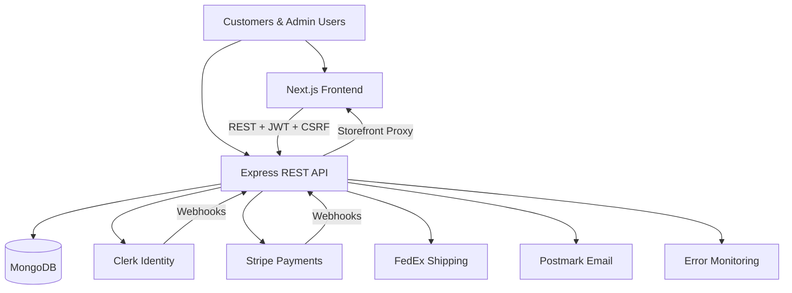

# 592 Industries Platform

A systems engineering case study documenting how an integrated business operations platform was designed, built, verified, and operated—from requirements through production.

---

## Overview

592 Industries is an engineering and technology solutions company serving customers who need custom manufacturing, software development, infrastructure services, and automation solutions. Rather than relying on restrictive third-party marketplace platforms, the company built a purpose-designed operations platform that unifies:

- **Software products** — storefront, customer dashboard, and admin portal
- **Additive manufacturing workflows** — order fulfillment, shipping, and production tracking
- **Customer-facing systems** — commerce, quotes, support, and account self-service
- **Operational processes** — fulfillment queues, finance reporting, audit logging, and team management

The platform was architected as a flexible business operations system—not a traditional ecommerce website—capable of supporting both standardized product sales and custom engineering engagements.

---

## Problem

### Customer challenges

- Engineering customers need both catalog products and bespoke project intake; a single checkout flow cannot serve both.
- Buyers require visibility into order status, tracking, billing, and support without contacting operations staff.
- Privacy-conscious users need self-service data export and account deletion.

### Operational challenges

- Fulfillment staff need structured workflows with state machines, not ad-hoc spreadsheets.
- Finance and support teams require role-appropriate access to orders, refunds, and customer records.
- Shipping economics (handling, packaging, markup) change frequently and must be configurable without code deployments.

### Need for an integrated platform

Website builders and SaaS ecommerce platforms offer rapid deployment but impose vendor-controlled workflows, limited customization, and reduced data ownership. 592 Industries required a system that maintained complete ownership over business logic, operational workflows, customer data, and service architecture.

---

## Solution

The platform delivers end-to-end capabilities across two primary customer journeys:

| Journey | Path | Outcome |
|---|---|---|
| **Standardized products** | Shop → Cart → Checkout → Payment → Fulfillment | Revenue from catalog items with FedEx shipping and Stripe payments |
| **Custom engineering** | Quote request → Admin review → Pricing → Customer acceptance | Structured intake for non-catalog engineering projects |

### Platform capabilities

- Public storefront with Stripe-backed product catalog
- Multi-step checkout with FedEx address validation and rate selection
- Customer dashboard for orders, quotes, billing, support, and privacy
- Admin portal with role-based access for fulfillment, finance, catalog, and support
- Webhook-driven order creation with idempotent processing
- Transactional email notifications for operational events

### Engineering approach

Requirements were defined before implementation. The backend was designed as a centralized API layer to support future clients (web, mobile, internal tools). External services handle specialized concerns—identity, payments, shipping, email—while business logic remains in-house.

---

## System Architecture

The system comprises two independently deployable services:

- **Frontend:** Next.js 16 App Router (TypeScript, React 19)
- **Backend:** Express 5 REST API (Node.js 20)

The backend reverse-proxies storefront traffic on the public API hostname, providing a single entry point for both the web application and API.

See [Architecture Overview](diagrams/architecture-overview.md) and [System Context](diagrams/system-context.md) for additional diagrams.

---

## Engineering Approach

| Phase | Practice |
|---|---|
| **Requirements** | Functional and non-functional requirements derived from business needs and stakeholder analysis |
| **Architecture** | Domain-driven backend, thin frontend, explicit service boundaries |
| **Interface design** | REST API with consistent response envelopes, CSRF protection, and capability-based admin RBAC |
| **Verification** | Automated unit and integration tests, launch-readiness gates, manual functional test procedures |
| **Operations** | CI/CD deploy pipelines, health endpoints, error monitoring, and documented incident response |

---

## Documentation

| Document | Description |
|---|---|
| [01 — Overview](docs/01-overview.md) | Executive summary and system goals |
| [02 — Product Requirements](docs/02-product-requirements.md) | User needs, functional and non-functional requirements |
| [03 — System Architecture](docs/03-system-architecture.md) | Components, data flow, and technology choices |
| [04 — User Workflows](docs/04-user-workflows.md) | End-to-end customer and operational journeys |
| [05 — Technical Decisions](docs/05-technical-decisions.md) | Integration strategy, boundaries, and tradeoffs |
| [06 — Verification & Validation](docs/06-verification-validation.md) | Testing strategy and launch readiness |
| [07 — Operations](docs/07-operations.md) | Deployment, monitoring, and maintenance |
| [08 — Risks & Tradeoffs](docs/08-risks-and-tradeoffs.md) | Known limitations and engineering tradeoffs |
| [09 — Lessons Learned](docs/09-lessons-learned.md) | Reflections on what worked and what to improve |

### Diagrams

- [System Context](diagrams/system-context.md)
- [Architecture Overview](diagrams/architecture-overview.md)
- [Workflow Overview](diagrams/workflow-overview.md)

---

## Technology Overview

Technologies verified in the application repositories:

| Layer | Technology |
|---|---|
| Frontend framework | Next.js 16, React 19, TypeScript |
| UI components | shadcn/ui, Radix UI, Tailwind CSS 4 |
| Backend framework | Express 5, Node.js 20 |
| Database | MongoDB (native driver) |
| Authentication | Clerk |
| Payments | Stripe Checkout, Stripe Tax, Billing Portal |
| Shipping | FedEx REST APIs |
| Email | Postmark |
| Maps | Mapbox |
| Error monitoring | Honeybadger |
| Secrets management | Doppler |
| Process management | PM2 |
| CI/CD | GitHub Actions |
| Testing | Vitest (frontend), Node test runner (backend) |
| Validation | Zod |

---

## Future Improvements

| Area | Direction |
|---|---|
| Mobile applications | Backend API designed for multi-client consumption |
| Cloud asset storage | Azure Blob client implemented; migration from local filesystem planned |
| CDN integration | Geographic distribution for static assets and images |
| Quote-to-order automation | Automated Stripe invoicing when customers accept quotes |
| Event-driven architecture | Message queue for webhook processing and email delivery |
| Horizontal scaling | Container orchestration beyond single-VM deployment |

---
## Project Ownership

This platform was designed and implemented by **Maurice Mooklall** as the sole engineer responsible for requirements engineering, system architecture, software development, verification and validation, deployment, and operational design for the Version 1 platform.

---
## Related Repositories

- [592 Industries Backend](https://github.com/592-Industries/592industries-backend)
- [592 Industries Frontend](https://github.com/592-Industries/592industries-frontend)

---

*This case study documents the Version 1 platform release (June 2026). It is intended for technical recruiters, product managers, engineers, and engineering collaborators evaluating systems design and product ownership capabilities.*
