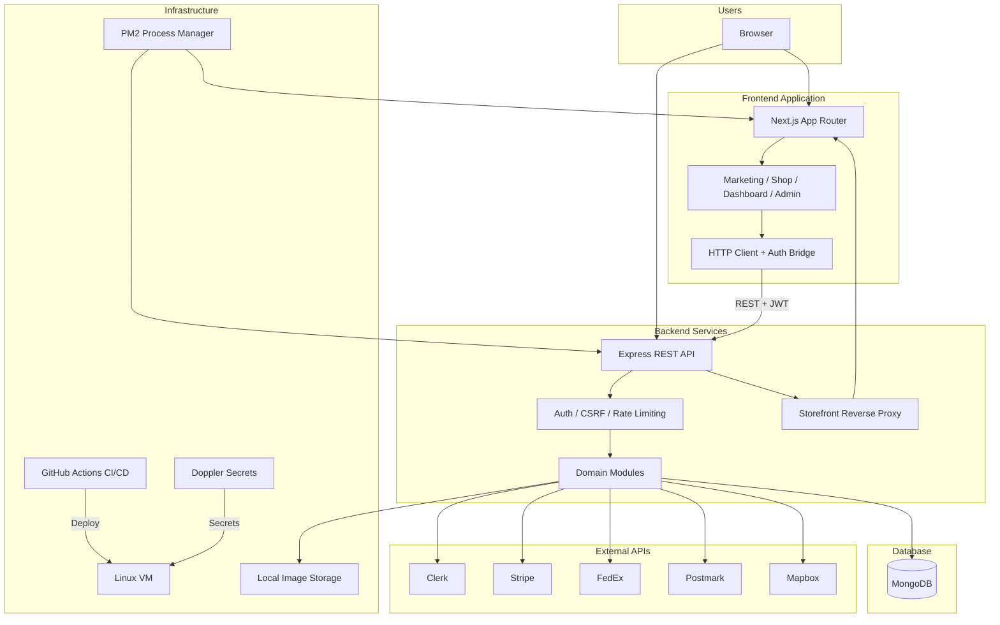

# Architecture Overview

High-level view of platform components and their relationships.

## Component responsibilities

| Component | Role |
|---|---|
| **Next.js Frontend** | User interface for storefront, customer dashboard, and admin portal |
| **Express Backend** | Central business logic, API contracts, webhook processing |
| **MongoDB** | Primary data store for users, orders, quotes, tickets, and audit logs |
| **External APIs** | Identity, payments, shipping, email, and geocoding |
| **Infrastructure** | VM hosting, process management, secrets injection, and automated deployment |

## Data flow pattern

1. Users interact with the Next.js frontend or API directly.
2. Authenticated requests carry Clerk JWTs; mutations require CSRF tokens.
3. The backend orchestrates external service calls and persists results to MongoDB.
4. Webhooks from Stripe and Clerk trigger asynchronous state updates (order creation, user sync).
