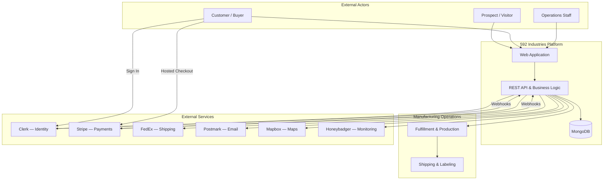

# System Context Diagram

This diagram shows how external actors and services interact with the 592 Industries platform.

## Context summary

| Boundary | Responsibility |
|---|---|
| **592 Industries Platform** | Business logic, workflows, customer data, operational tooling |
| **Manufacturing Operations** | Order processing, production, packing, and shipment creation |
| **External Services** | Specialized capabilities delegated to industry-standard providers |

The platform maintains ownership of business rules and data while integrating external services for identity, payments, shipping, and communications.
