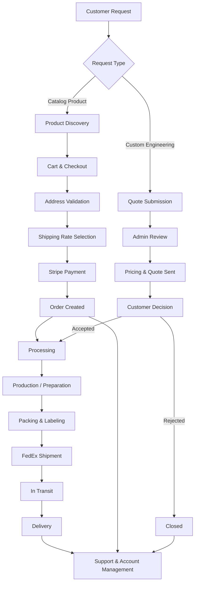

# Workflow Overview

End-to-end journey from customer request through delivery.

## Workflow phases

| Phase | Description | Primary actors |
|---|---|---|
| **Customer Request** | Browse catalog or submit engineering quote | Customer, Prospect |
| **Processing** | Payment confirmation or quote review | System, Admin |
| **Production** | Manufacturing, preparation, or project scoping | Fulfillment staff |
| **Delivery** | Shipping, tracking, and delivery confirmation | FedEx, Customer |
| **Support** | Tickets, returns, billing, and account management | Customer, Support |

## Dual revenue paths

The platform supports two complementary business models:

1. **Storefront commerce** — Self-service purchase of standardized products with automated checkout and webhook-driven order creation.
2. **Custom quotes** — Structured intake for engineering projects requiring manual pricing and admin review before acceptance.

Both paths converge at fulfillment and ongoing customer relationship management.
