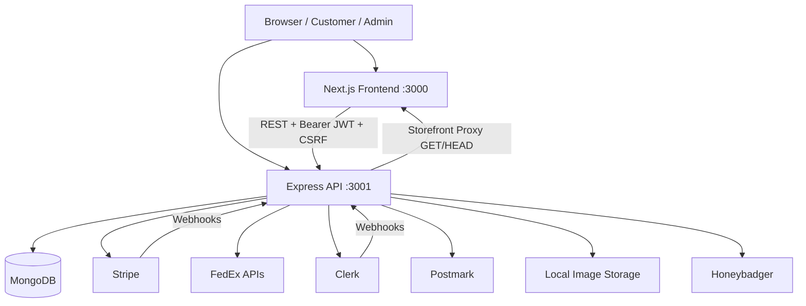
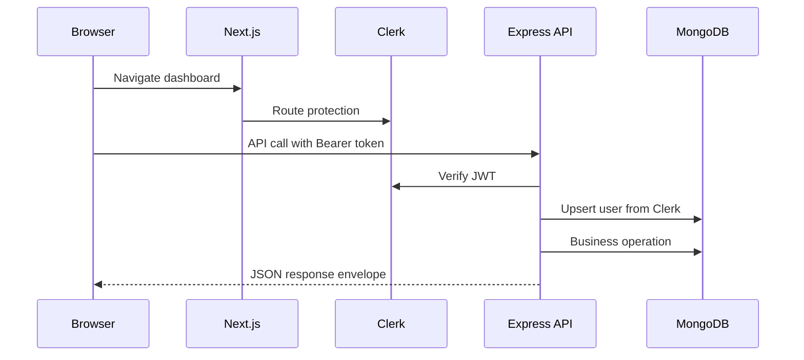
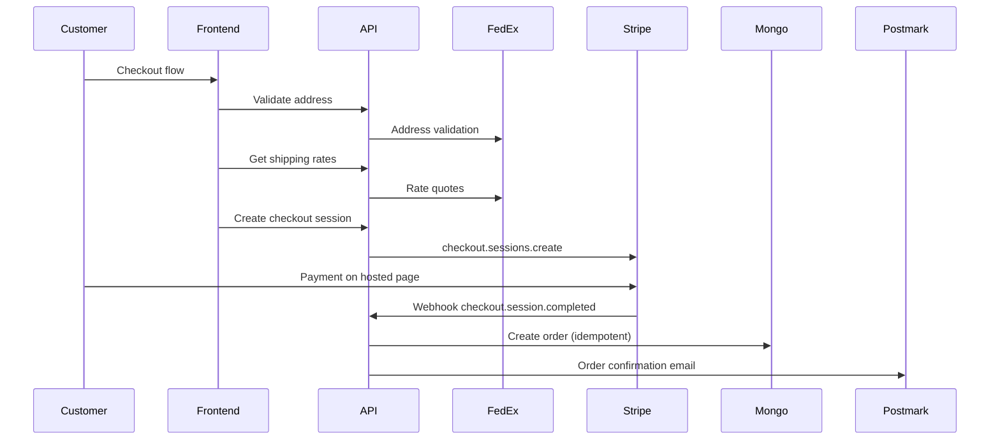
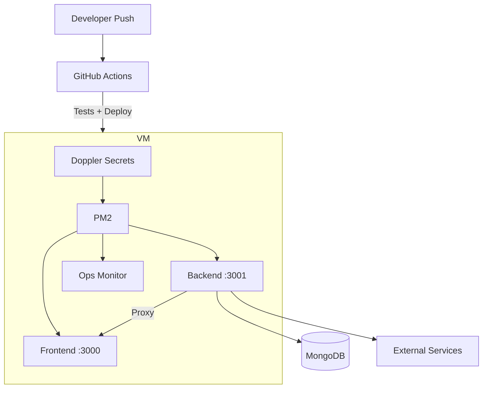
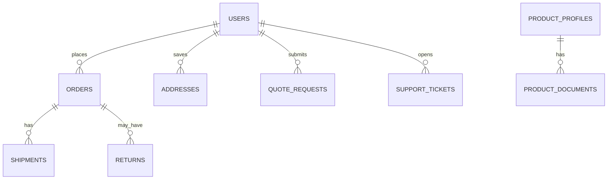

# System Architecture

How the 592 Industries platform is structured, how data flows, and why key technology choices were made.

---

## High-Level Architecture

592 Industries is a two-service platform with a centralized business logic layer:

### Architecture philosophy

> Build the platform first. Build interfaces around the platform.

The backend was designed as a centralized service layer supporting future clients: web applications (current), mobile apps (planned), internal tools, and customer-specific portals. The frontend contains no business logic for orders, payments, shipping, or admin operations.

---

## Major System Components

### Frontend (Next.js)

| Area | Routes | Responsibility |
|---|---|---|
| Marketing | Home, about, capabilities, contact, services | Public content and lead generation |
| Commerce | Shop, cart, checkout | Product browsing and purchase flow |
| Dashboard | Orders, quotes, support, billing, privacy | Customer self-service |
| Admin | Orders, catalog, tickets, finance, settings | Operational management |
| Policies | Terms, privacy, shipping, returns | Legal compliance content |

**Key patterns:**
- SWR for server data caching
- React Context for cart and auth state
- Clerk middleware for route protection
- Thin API client with CSRF auto-retry

### Backend (Express)

Domain-driven route modules organized by business area:

| Domain | Responsibility |
|---|---|
| Account | Profile, billing, addresses, privacy |
| Admin | Orders, customers, finance, settings, audit |
| Auth | CSRF, session identity |
| Checkout | Shipping validation, rate quotes, Stripe sessions |
| Orders | Lifecycle, returns, timeline |
| Products | Catalog and fulfillment profiles |
| Quotes | Custom engineering quote workflow |
| Support | Ticket management |
| Webhooks | Stripe and Clerk event processing |

### Database (MongoDB)

Document-oriented storage with application-level schema enforcement:

| Collection | Purpose |
|---|---|
| users | Accounts synced from Clerk |
| orders | Payment, fulfillment, and shipping status |
| shipments | FedEx labels and tracking events |
| quoteRequests | Custom engineering quotes |
| supportTickets | Support conversations |
| auditLogs | Admin action trail |
| webhookReceipts | Webhook idempotency |

---

## Data Flow

### Authenticated API request

### Checkout and payment

---

## Technology Choices

| Layer | Choice | Rationale |
|---|---|---|
| Frontend | Next.js 16 App Router | SSR, routing, API routes, Clerk integration |
| Backend | Express 5 | Explicit middleware ordering, webhook raw body handling |
| Database | MongoDB (native driver) | Flexible document model for evolving entities |
| Auth | Clerk | Reduced PCI scope, MFA, webhook user sync |
| Payments | Stripe Checkout | PCI reduction, automatic tax, billing portal |
| Shipping | FedEx REST APIs | Address validation, rates, labels, tracking |
| Email | Postmark | Reliable transactional delivery |
| Secrets | Doppler | Centralized rotation, no repo secrets |
| Hosting | Linux VM + PM2 | Simple deployment matching current scale |
| CI/CD | GitHub Actions | Per-repository pipelines with health gates |

---

## System Boundaries

### What the platform owns

- Business logic and workflow state machines
- Customer and order data in MongoDB
- Admin RBAC and capability enforcement
- Shipping pricing rules and fulfillment profiles
- Audit trail and operational dashboards

### What external services own

| Service | Owned capability |
|---|---|
| Clerk | Credentials, MFA, session management |
| Stripe | Payment processing, tax calculation, card storage |
| FedEx | Carrier rates, labels, tracking events |
| Postmark | Email delivery infrastructure |
| Mapbox | Geocoding and map rendering |

### Integration boundary principles

1. Webhooks are the authoritative path for payment confirmation and user sync
2. Idempotency keys prevent duplicate records on retries
3. Launch readiness validates environment coherence at startup
4. Health endpoints surface dependency status for operations

---

## Authentication and authorization

### Customer authentication

Clerk handles sign-in/sign-up. The frontend bridges Clerk JWTs to API calls; the backend verifies tokens and upserts user records on every authenticated request.

### Admin authorization

Five roles with capability-based permissions:

| Role | Access scope |
|---|---|
| Owner | All 22 capabilities |
| Manager | Operations, catalog, tickets, settings (no owner promotion) |
| Staff | Assigned orders, fulfillment, shipping |
| Support agent | Tickets, read-only orders and customers |
| Finance viewer | Revenue, refunds, read-only orders |

CSRF protection applies to all state-changing requests via double-submit cookie pattern.

---

## Deployment topology

Both services deploy to Linux VMs via GitHub Actions. The backend reverse-proxies non-API traffic to the frontend, providing a single public hostname.

---

## Entity relationships

---

## Related documents

- [Architecture Overview diagram →](../diagrams/architecture-overview.md)
- [Technical Decisions →](05-technical-decisions.md)
- [Operations →](07-operations.md)
