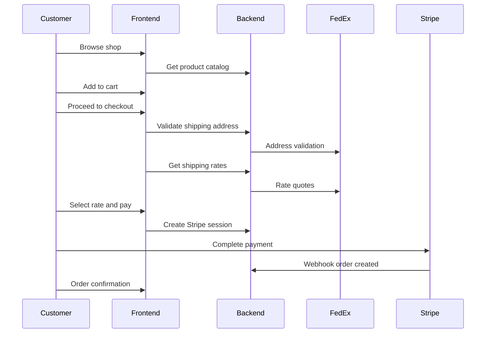
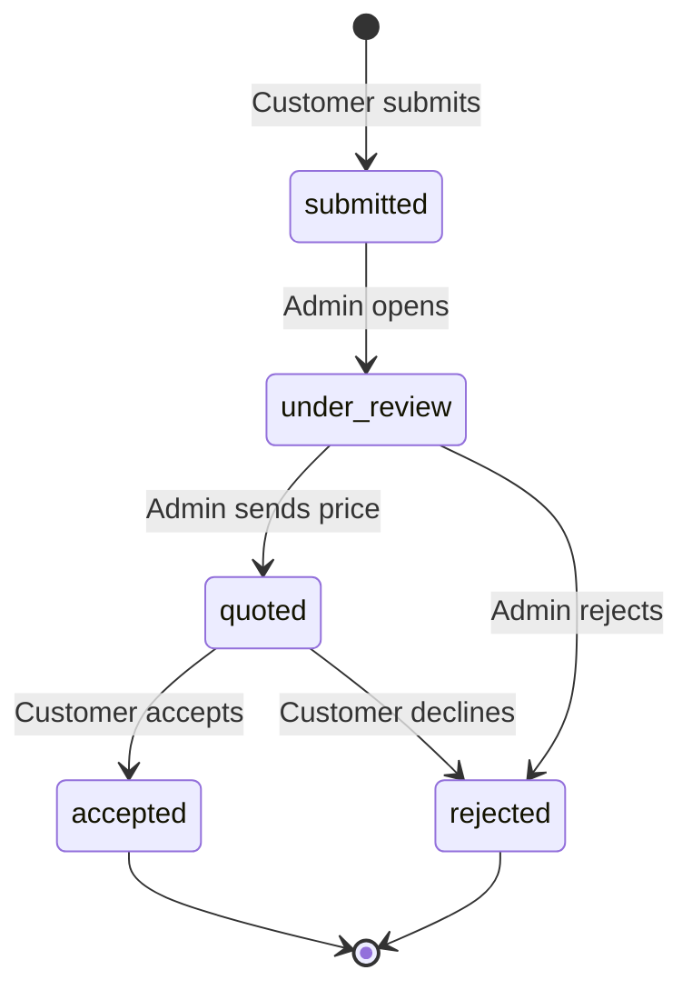
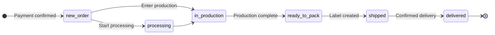
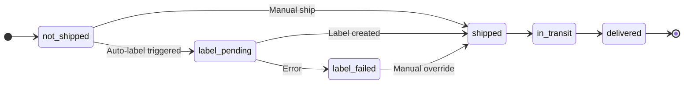
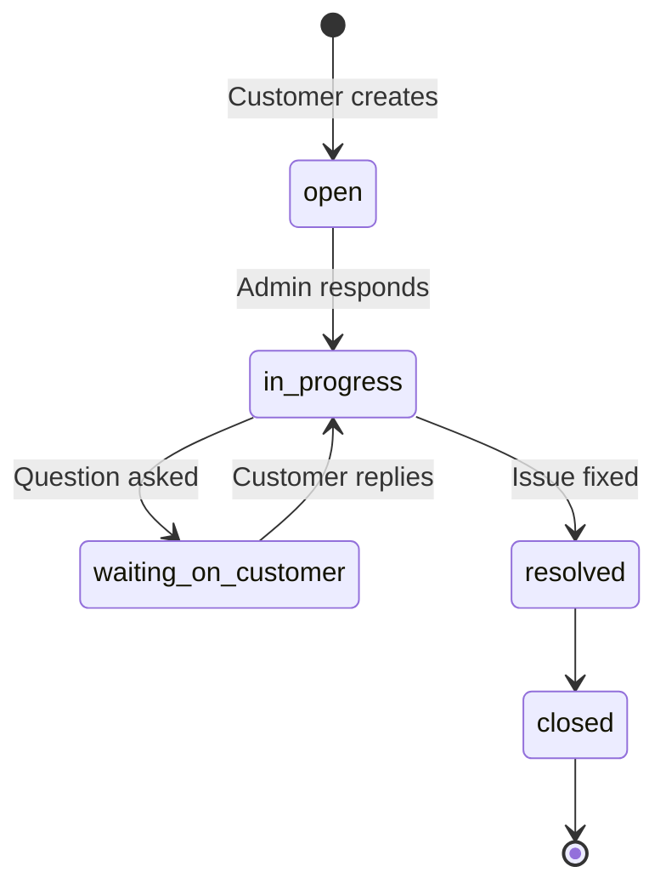

# User Workflows

How customers and operations staff move through the platform—from discovery through support.

---

## End-to-End Customer Journey

```
Customer Discovery
        ↓
Quote / Product Selection
        ↓
Checkout
        ↓
Payment
        ↓
Manufacturing / Preparation
        ↓
Fulfillment
        ↓
Support
```

The platform supports two entry paths that converge at fulfillment and ongoing customer management.

---

## Workflow 1: Customer Commerce

The primary revenue path for standardized catalog products.

### Overview



### Phase 1: Product discovery

| Step | Action | Outcome |
|---|---|---|
| Browse catalog | Customer visits shop | Active products with prices and fulfillment metadata |
| View detail | Product page with specifications | Datasheets and documents available for download |
| Add to cart | Product added with quantity | Cart persisted in browser local storage |

### Phase 2: Checkout

| Step | Action | Outcome |
|---|---|---|
| Enter address | US shipping address with autocomplete | FedEx validates and stores address snapshot |
| Select shipping | Customer chooses from computed rates | Rate locked in quote snapshot before payment |
| Review and pay | Order summary displayed | Stripe Checkout session created with line items, shipping, and tax |

**Design decision:** Shipping rates are computed and selected *before* payment. This prevents stale shipping charges and ensures checkout total accuracy.

### Phase 3: Post-payment

| Step | Action | Outcome |
|---|---|---|
| Webhook processing | Stripe confirms payment | Order created idempotently in database |
| Confirmation email | Postmark sends notification | Customer receives order details |
| Optional auto-label | If enabled, FedEx label created | Shipping status moves to label pending |
| Success page | Customer redirected | Cart cleared; order visible in dashboard |

### Guest checkout

Unauthenticated users can complete checkout. If a Clerk session exists, orders link to the customer account automatically.

---

## Workflow 2: Custom Quote

The primary path for custom engineering projects outside the catalog.

### Status lifecycle



### Customer submission

| Field | Purpose |
|---|---|
| Title and description | Project scope and engineering requirements |
| Category, budget, deadline | Classification and constraints |
| Quantity and file links | Specifications and reference materials |
| Contact details | Follow-up communication |

**Entry points:**
- Dashboard quote form (primary)
- Contact form redirects quote inquiries to structured intake

**Idempotency:** Duplicate submissions with the same key return the existing quote without creating duplicates.

### Admin review

1. Admin views quote queue and opens detail
2. Admin evaluates requirements and sets quoted amount
3. Admin sends quote — customer receives email notification
4. Customer reviews quoted amount in dashboard

**V1 limitation:** Accepted quotes do not automatically convert to orders. Custom project billing requires manual follow-up.

---

## Workflow 3: Order Fulfillment

Admin-driven operational workflow from paid order through delivery.

### Fulfillment state machine



### Shipping state machine



### Fulfillment phases

| Phase | Actor | Actions |
|---|---|---|
| **Intake** | System | Webhook creates order; confirmation email sent |
| **Queue management** | Admin | Filter by bucket; assign to staff |
| **Processing** | Fulfillment staff | Update status; add internal notes |
| **Shipping** | Admin | Create FedEx shipment; download label; sync tracking |
| **Delivery** | System + FedEx | Tracking updates; customer notifications |
| **Returns/refunds** | Customer + Finance | Return requests; Stripe refund processing |

**Staff access:** Fulfillment staff see only orders assigned to them or unassigned queue items.

---

## Workflow 4: Support and Account

Ongoing customer relationship management after purchase or quote submission.

### Account management

| Section | Capabilities |
|---|---|
| Profile | Update name and preferences; syncs to Clerk |
| Addresses | CRUD with US autocomplete; default shipping/billing |
| Billing | View payment methods; Stripe billing portal |
| Privacy | Data export; scheduled account deletion |

### Support tickets



**Entry points:**
- Dashboard support page
- Order-linked support from order detail
- Floating chat widget for signed-in users

### Privacy workflow

1. Customer requests data export → JSON bundle downloaded
2. Customer requests deletion → scheduled via grace period
3. Customer may cancel deletion before execution

---

## Workflow design principles

| Principle | Application |
|---|---|
| **Separate paths for separate needs** | Commerce and quotes are distinct workflows with different automation levels |
| **State machines prevent invalid transitions** | Fulfillment and shipping statuses enforce operational discipline |
| **Webhooks as source of truth** | Payment confirmation drives order creation, not client-side callbacks |
| **Self-service reduces support load** | Customers track orders, manage billing, and export data independently |
| **Role-appropriate admin views** | Staff, support, and finance see only what their role requires |

---

## Related documents

- [Workflow Overview diagram →](../diagrams/workflow-overview.md)
- [Technical Decisions →](05-technical-decisions.md)
- [Operations →](07-operations.md)
