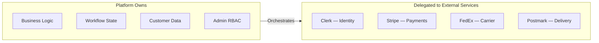

# Technical Decisions

Major architectural and integration decisions, the reasoning behind them, and the tradeoffs accepted.

---

## Decision framework

Each technical decision balanced three factors:

1. **Business flexibility** — Can the platform support non-standard engineering workflows?
2. **Operational responsibility** — What does the team own vs. delegate?
3. **Time to production** — What enables a focused V1 release without compromising foundations?

---

## Platform architecture decisions

### Custom platform instead of SaaS website builder

**Decision:** Build a custom platform rather than use Shopify, Squarespace, or similar.

**Reasoning:** The business required custom workflows, complete data ownership, operational flexibility, and future expansion capability that marketplace platforms cannot provide. Engineering services involve quote-based sales, fulfillment state machines, and role-based admin access—not standard ecommerce patterns.

**Tradeoff:** Higher initial development and infrastructure cost. Full responsibility for security, compliance, and operations.

---

### Separate frontend and backend services

**Decision:** Maintain independent Next.js frontend and Express backend deployable as separate processes.

**Reasoning:** Future clients (iOS, Android, internal tools) can consume the same backend APIs without duplicating business logic. The frontend remains a thin presentation layer.

**Tradeoff:** Two deployment pipelines, CORS management, and API versioning discipline required. Storefront reverse proxy adds routing complexity.

---

### MongoDB without ORM

**Decision:** MongoDB with native driver; no Mongoose or similar ORM.

**Reasoning:** Flexible document model suits evolving business entities—orders with nested line items, shipping snapshots, audit logs. Rapid iteration without migration overhead for schema changes during V1 development.

**Tradeoff:** Schema enforcement is application-level. Indexes must be managed explicitly via deploy scripts.

---

## Integration decisions

### Why Clerk for identity

**Decision:** Delegate authentication to Clerk rather than build first-party auth.

**Reasoning:**
- Reduces PCI scope and security maintenance burden
- Provides MFA, account recovery, and hosted sign-in UI
- Webhook-based user sync keeps backend records consistent

**Tradeoff:** External dependency for all identity flows. Legacy auth routes retired with HTTP 410 responses. Role management split between Clerk metadata and MongoDB.

**Integration pattern:**
- Frontend: Clerk middleware protects routes; `getToken()` bridges to API
- Backend: JWT verification on every authenticated request; user upsert to MongoDB
- Webhooks: Svix-verified lifecycle events (created, updated, deleted)

---

### Why Stripe Checkout (hosted)

**Decision:** Stripe Checkout with webhook-driven order creation, not embedded payment forms.

**Reasoning:**
- PCI scope reduction—no card data touches platform servers
- Stripe Tax handles sales tax compliance
- Industry-standard payment UX with dispute and refund APIs
- Billing portal for saved payment methods

**Tradeoff:** Payment form is Stripe-hosted with limited customization. Webhook reliability is critical—if webhooks fail, orders are not created despite successful payment.

**Mitigation:** Idempotent webhook processing, success page polling by session ID, operational monitoring of webhook receipt freshness.

---

### Why FedEx for shipping

**Decision:** Integrate FedEx REST APIs for address validation, rate quotes, label creation, and tracking.

**Reasoning:**
- Shipping cost must be determined before payment (quote-gated checkout)
- Label automation reduces manual fulfillment steps
- Tracking sync provides customer visibility

**Tradeoff:** Checkout cannot complete without FedEx rates. US domestic only in V1. Sandbox behavior differs from production.

**Mitigation:** Sandbox rate estimation fallback, `label_failed` status for retry, admin manual tracking entry, environment coherence validation at startup.

---

### Why Postmark for email

**Decision:** Postmark for transactional email; separate path for contact form.

**Reasoning:** Reliable delivery for operational events (order confirmation, quote ready, support replies). Template-based emails with idempotency and suppression list handling.

**Tradeoff:** Transactional only—no marketing campaigns. Operations continue without email but customer communication degrades.

---

### Why local filesystem for assets (not cloud storage)

**Decision:** Local disk storage for CMS images instead of Azure Blob Storage.

**Reasoning:** Simpler deployment on existing VM infrastructure. No additional cloud storage account required for V1 CMS images.

**Tradeoff:** No CDN integration. Single-server storage limits horizontal scaling. Azure Blob client exists for potential future migration.

---

### Why Doppler for secrets

**Decision:** All production secrets injected via Doppler at build and runtime.

**Reasoning:** Centralized secret management across staging and production. No secrets committed to repositories or deployed environment files.

**Tradeoff:** Doppler availability required for deploys. Running processes retain cached secrets during brief outages.

---

## API design decisions

### REST with consistent envelope

All API responses use `{ success, data }` or `{ success, error }` format. This enables predictable client parsing and consistent error handling across all domains.

### CSRF on mutations

Double-submit cookie pattern protects authenticated browser sessions from cross-site request forgery. Webhook endpoints are exempt (signature-verified instead).

### Capability-based admin RBAC

22 granular capabilities mapped to five roles. Both backend middleware and frontend navigation enforce the same permission model.

### Idempotency keys

Quote creation, support ticket creation, and checkout session creation accept idempotency keys. Network retries do not create duplicate business records.

---

## System boundary summary

| Boundary | Platform responsibility | External responsibility |
|---|---|---|
| **Payments** | Order creation, refund initiation, metadata | Card processing, tax, PCI compliance |
| **Identity** | RBAC, user records, session bridge | Credentials, MFA, hosted UI |
| **Shipping** | Pricing rules, fulfillment state | Rates, labels, carrier tracking |
| **Email** | Template content, trigger logic | Delivery infrastructure |

---

## Environment coherence

Production deployments validate that integration modes are coherent:

| Environment | Stripe | FedEx | Purpose |
|---|---|---|---|
| Production | Live keys | Production API | Real commerce |
| Staging | Test keys | Sandbox API | Safe testing |
| Production + override flag | Test allowed | Sandbox allowed | Temporary testing only |

Startup validation blocks accidental production deployment with test credentials unless explicitly overridden.

---

## Related documents

- [System Architecture →](03-system-architecture.md)
- [Risks & Tradeoffs →](08-risks-and-tradeoffs.md)
- [External integrations detail →](03-system-architecture.md#technology-choices)
